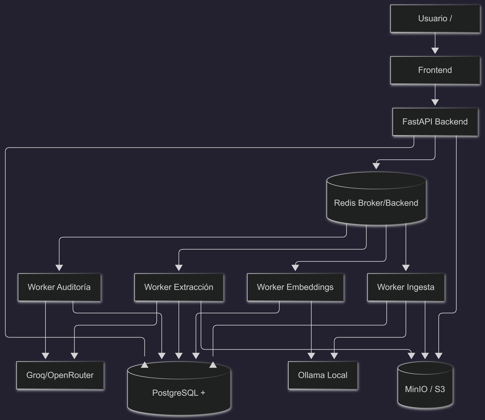

# Evidence Crusher
[](https://github.com/isak-rp/evidence-crusher/actions/workflows/ci.yml)

Plataforma LegalTech para ingesta documental, extracción jurídica trazable y análisis técnico de expedientes laborales.

## Qué resuelve
- Centraliza documentos del caso en una sola interfaz.
- Procesa y clasifica evidencia de forma asíncrona.
- Construye ficha técnica con semáforo de riesgo, fuentes y trazabilidad.
- Permite revisar evidencia en PDF con navegación directa a la fuente.

## Stack
- Backend: FastAPI + Celery + SQLAlchemy
- Frontend: Streamlit
- Base de datos: PostgreSQL + pgvector
- Almacenamiento de archivos: MinIO (S3 compatible)
- Cola: Redis
- IA:
  - Ollama local para tareas rápidas/costo eficiente
  - Groq para tareas de mayor calidad de razonamiento y extracción

## Diagrama de arquitectura


## Decisiones técnicas
### Por qué Docker
- Entorno reproducible para todo el equipo (backend, frontend, DB, workers).
- Menos fricción para levantar servicios dependientes (Postgres, Redis, MinIO, Ollama).
- Facilita escalar workers por cola sin acoplar al host local.

### Por qué este esquema de modelos
- Modelo local liviano (Ollama) para tareas frecuentes y de bajo costo.
- Modelo más potente (Groq/OpenRouter) para extracción/auditoría donde la precisión importa más.
- Estrategia híbrida: menor costo operativo + mejor calidad en puntos críticos.

### Persistencia de datos
- Metadatos y hechos técnicos: PostgreSQL.
- Vectores para búsqueda semántica: pgvector.
- Archivos originales: MinIO.
- Estado de tareas asíncronas: Redis/Celery backend.
- Resultado: trazabilidad completa de dato + fuente + estado de procesamiento.

## Servicios principales
- `backend`: API REST y reglas de negocio.
- `frontend`: interfaz Streamlit.
- `db`: PostgreSQL con pgvector.
- `redis`: broker/resultado Celery.
- `minio`: almacenamiento documental.
- `worker-ingest`: OCR + clasificación.
- `worker-embed`: embeddings.
- `worker-extract`: extracción estructurada.
- `worker-audit`: validaciones y consistencia.

## Variables de entorno clave
Revisa `.env.example` y crea `.env`.

```env
# DB
DATABASE_URL=postgresql://admin:legalpassword123@db:5432/legal_audit_db

# Redis / Celery
CELERY_BROKER_URL=redis://redis:6379/0
CELERY_RESULT_BACKEND=redis://redis:6379/1

# MinIO
S3_ENDPOINT=http://minio:9000
S3_ACCESS_KEY=minioadmin
S3_SECRET_KEY=minioadmin
S3_BUCKET=evidence-crusher
S3_REGION=us-east-1

# IA
AI_PROVIDER=ollama|groq|openrouter
OLLAMA_URL=http://ollama:11434
OLLAMA_EMBED_MODEL=mxbai-embed-large
OLLAMA_LLM_MODEL=llama3.2:1b
GROQ_API_KEY=
OPENROUTER_API_KEY=

# Ficha técnica
TECH_SHEET_V2_ENABLED=true
TECH_SHEET_PHASE2_ENABLED=true
TECH_SHEET_NARRATIVE_MODE=HYBRID
```

## Quick Start (Docker)
1. Levantar stack:
```bash
docker compose up --build -d
```
2. Frontend: `http://localhost:8501`
3. API: `http://localhost:8000`
4. MinIO Console: `http://localhost:9001`

## Migraciones
Ejecutar dentro de backend container:
```bash
docker compose exec backend sh -lc "cd /app && PYTHONPATH=/app alembic upgrade head"
```

## Flujo operativo
1. Subir documentos.
2. Clasificación/OCR (`ingest`).
3. Indexación (`embed`).
4. Extracción técnica (`extract`).
5. Auditoría (`audit`).
6. Revisión en ficha técnica con fuentes.

## Endpoints clave
- `POST /api/v1/documents/{id}/process`
- `POST /api/v1/documents/{id}/embed`
- `GET /api/v1/documents/{id}/file`
- `POST /api/v1/documents/{id}/chat`
- `POST /api/v1/cases/{id}/extract-metadata`
- `POST /api/v1/cases/{id}/build-technical-sheet`
- `GET /api/v1/cases/{id}/technical-sheet`
- `GET /api/v1/tasks/{task_id}`

## CI/CD (GitHub Actions)
El repositorio incluye pipeline para:
- `ruff check` (calidad estática)
- `pytest` (pruebas unitarias/integración básica)

Archivo: `.github/workflows/ci.yml`

## Versionado de datasets con DVC
Este proyecto usa DVC para versionar datasets de evaluación sin cargar archivos pesados al historial de Git.

Dataset actual en DVC:
- `scripts/datasets/techsheet_v1.dvc`

Comandos útiles:
```bash
# Si no tienes dependencias MLOps instaladas
pip install -r scripts/requirements-mlops.txt

# Descargar dataset desde remoto DVC (cuando configures remote)
python -m dvc pull

# Actualizar dataset y regenerar .dvc
python -m dvc add scripts/datasets/techsheet_v1
git add scripts/datasets/techsheet_v1.dvc scripts/datasets/.gitignore
```

Nota:
- El contenido del dataset se comparte vía remote DVC (S3/GDrive/MinIO/etc.).

## Tracking de métricas con MLflow
Script integrado:
- `scripts/track_eval_mlflow.py`

Métricas registradas:
- `accuracy_pct`
- `coverage_pct`
- `critical_coverage_pct`
- `avg_api_latency_ms`
- `avg_build_latency_sec`
- `tokens_per_second` (si proporcionas `--token-count`)

## Calidad de código (Ruff)
Configuración base en `ruff.toml`.

Comandos locales:
```bash
ruff check backend frontend
ruff check backend frontend --fix
```

## Política de archivos versionados (Git Ignore)
Qué sí se versiona:
- Código fuente (`backend/`, `frontend/`, `scripts/`).
- Migraciones de base de datos (`backend/alembic/versions/`).
- Configuración de CI/CD (`.github/workflows/`).
- Plantillas de entorno sin secretos (`.env.example`).

Qué no se versiona:
- Secretos y entornos locales (`.env`, `.env.*`, `venv/`, `.venv/`).
- Cachés y artefactos temporales (`__pycache__/`, `.pytest_cache/`, `.ruff_cache/`).
- Datos locales y archivos subidos de prueba (`uploaded_files/`, `logs/`, `data/`, `*.db`).

## Seguridad y operación
- Mantener secretos fuera del repositorio (`.env`, GitHub Secrets).
- Limitar CORS y endurecer configuraciones para producción.
- Programar backups de PostgreSQL y MinIO.
- Monitorear latencia de tareas y tasa de errores por worker.
